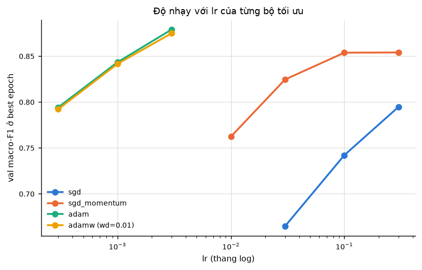
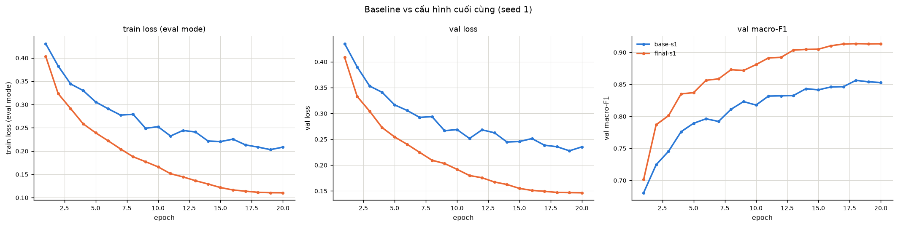

# Báo cáo Lab Day 1 — Đoàn Anh Quân — 2A202602803

Số liệu lấy từ `experiments.xlsx` (theo `exp_id`; trung bình, σ ở sheet `Seeds`; Δ ở cột `delta_val_f1_vs_base`; chuẩn gradient và std kích hoạt ở cột `notes`). Điểm eval lấy từ `eval_result.json`. Mọi so sánh dùng **val**; Δ là chênh lệch val macro-F1 so với trung bình 3 seed baseline.

## 1. Thiết lập

- **Môi trường:** máy cá nhân, GPU Apple qua MPS (không phải CUDA), PyTorch 2.14.1.
- **Dữ liệu:** `train` 464 809 / `eval` 116 203 theo `split_metadata.csv`; validation 20% của train (phân tầng, seed 42) → 371 847 / 92 962. Chuẩn hoá 10 cột số bằng thống kê của phần train còn lại.
- **Baseline:** `M-base` (54→256→128→7, 47 879 tham số), CE, SGD + momentum 0.9, batch 512, 20 epoch, He, FP32. lr chọn bằng val trong lưới 0.01 / 0.03 / 0.1 / 0.3 → macro-F1 0.7623 / 0.8245 / 0.8537 / 0.8539 (`hp-lr0.01`, `hp-lr0.03`, `hp-lr0.1`, `base-s1`); chọn **0.3**, ở mép trên của lưới.
- **Mốc:** "đoán lớp đa số" cho accuracy 0.4876 trên val.
- **Chủ đề đã thử:** ☑ loss ☑ optimizer ☑ hyper-parameter ☑ dropout ☑ clipping ☑ mixed precision ☑ init (40 lần chạy).

## 2. Kiểm tra ban đầu và độ nhiễu

| Kiểm tra | Kết quả |
|---|---|
| Số tham số / shape logits | 47 879 / (B, 7) |
| Loss bước 0 (ln 7 = 1.9459) | 2.2691 với He (`base-s1`); 1.9460 khi khởi tạo nhỏ (`init-normal`) |
| Quá khớp 20 mẫu | loss về gần 0, accuracy 100% (notebook, Part 1) |
| Mọi tham số có gradient khác 0 | ☑ có |
| Baseline, số seed | 3 (`base-s1..3`) |
| Val acc (TB ± σ) | 0.9133 ± 0.0034 |
| Val macro-F1 (TB ± σ) | 0.8540 ± 0.0117 |

**Ngưỡng nhiễu:** 2σ = **0.0234** (val macro-F1). Với 3 seed, σ chỉ là ước lượng thô.

Loss bước 0 của He cao hơn ln 7 vì He đặt `Var[W] = 2/n_vào` cho cả lớp cuối, nên logit ban đầu có std 0.5773 chứ không gần 0; khởi tạo nhỏ cho đúng ln 7. Baseline chưa khớp hết: best epoch 19/19/20, khoảng cách val − train loss chỉ 0.0269 (`base-s1`).

## 3. Kết quả theo chủ đề

### 3.1 Hàm mất mát
- **Dự đoán:** MSE kém hơn vì gradient theo logit nhỏ hơn.
- **Kết quả:** `loss-mse` đạt 0.7839 (Δ −0.0701, vượt 2σ), accuracy 0.8825 so với 0.9094. Chuẩn gradient trung bình 0.068 so với 0.357 của `base-s1` (`compare_loss.png`).
- **Cơ chế:** MSE trung bình trên B × 7 phần tử cho gradient `2(z − onehot)/7`, bị chia cho số lớp; CE cho `softmax − onehot`, lớn khi sai nặng. Không so loss trực tiếp vì khác thang đo. Hạn chế: lr không được chỉnh riêng cho MSE.

### 3.2 Bộ tối ưu hoá
- **Dự đoán:** Adam nhỉnh hơn SGD+momentum và ít nhạy lr hơn; AdamW ≈ Adam.

| Bộ tối ưu | lr tốt nhất | exp_id | val macro-F1 | Δ | vượt 2σ? |
|---|---|---|---|---|---|
| SGD | 0.3 | `opt-sgd-lr0.3` | 0.7946 | −0.0594 | Có |
| SGD + momentum | 0.3 | `base-s1` | 0.8539 | 0 | — |
| Adam | 0.003 | `opt-adam-lr0.003` | 0.8789 | +0.0249 | Có (sát ngưỡng) |
| AdamW (wd 0.01) | 0.003 | `opt-adamw-lr0.003` | 0.8748 | +0.0209 | Không |

- **Kết luận:** Adam hơn SGD+momentum 0.0249, chỉ vừa qua 2σ: bằng chứng yếu. AdamW không phân biệt được với Adam. SGD thuần thua rõ vì thiếu momentum (bước hiệu dụng nhỏ hơn ~10 lần).
- **Độ nhạy lr:** mọi bộ tăng đơn điệu theo lr; Adam đi từ 0.7941 (`opt-adam-lr0.0003`) lên 0.8789, tức cũng nhạy lr, trái dự đoán. `opt-adamw-wd0-lr0.001` trùng `opt-adam-lr0.001` (cùng 0.8433), đúng công thức.
- **Hạn chế:** lr tốt nhất của cả 4 bộ nằm ở mép trên của lưới.

### 3.3 Hyper-parameter

| exp_id | Đổi gì | val macro-F1 | Δ | vượt 2σ? | s/epoch |
|---|---|---|---|---|---|
| `hp-batch128` | batch 128 | 0.7970 | −0.0570 | Có | 2.16 |
| `hp-batch2048` | batch 2048 | 0.8370 | −0.0169 | Không | 0.20 |
| `hp-batch2048-lrx4` | batch 2048, lr 1.2 | 0.6224 | −0.2316 | Có | 0.20 |
| `hp-wide` | 512-256 | 0.8776 | +0.0236 | Có (sát ngưỡng) | 0.84 |
| `hp-deep` | 256-128-64 | 0.8433 | −0.0106 | Không | 0.74 |
| `hp-wd1e-4` | weight decay 1e-4 | 0.8108 | −0.0432 | Có | 0.75 |
| `hp-ep40` | 40 epoch | 0.8676 | +0.0136 | Không | 0.68 |

- **Batch 128 kém hơn, trái dự đoán.** Tôi dự đoán nhiều bước cập nhật hơn thì tốt hơn (4 lần số bước, chậm gấp ~3.7 lần mỗi epoch), nhưng bỏ qua việc lr 0.3 được chọn cho batch 512: nhiễu SGD tỉ lệ với lr/batch, nên giảm batch 4 lần tương đương tăng lr 4 lần. Cùng lý do, quy tắc "lô × 4 thì lr × 4" hỏng ở `hp-batch2048-lrx4` (gai gradient 14.8).
- **Năng lực:** mạng rộng giúp; thêm một lớp 64 nơ-ron thì không. Weight decay có hại vì mô hình chưa khớp hết. 40 epoch chưa vượt nhiễu (`compare_hparam_capacity.png`).

### 3.4 Dropout
- **Dự đoán:** không giúp vì mô hình chưa quá khớp.
- **Kết quả:** `drop-0.1` 0.8309 (Δ −0.0231, chưa vượt 2σ), `drop-0.3` 0.7750 (Δ −0.0790), `drop-0.5` 0.6574 (Δ −0.1965). Khoảng cách val − train loss: 0.0269 (q = 0) → 0.0146 → 0.0073 → 0.0041.
- **Cơ chế:** khoảng cách thu hẹp vì train loss **tăng** (0.2083 → 0.2304 → 0.3078 → 0.4162, đo ở `eval()`), không phải vì val loss giảm. Dropout chỉ lấy bớt năng lực của mạng nhỏ (`compare_dropout.png`).

### 3.5 Gradient clipping
- **Chọn c:** c = 0.18, bằng một nửa trung vị `grad_norm` của `base-s1`, để clipping chắc chắn kích hoạt.
- **lr bình thường:** `clip-normal` bị cắt ở 100% số bước nhưng đạt 0.8516 (Δ −0.0024, trong nhiễu).
- **lr × 10 = 3:** không clip (`clip-highlr-noclip`) sụp về đúng mức "đoán đa số" (accuracy 0.4876, macro-F1 0.0936) sau một gai gradient 164, không thành NaN. Có clip (`clip-highlr`) huấn luyện được: accuracy 0.7327, macro-F1 0.4494, 85% số bước bị cắt.
- **Cơ chế:** một bước quá lớn đẩy nơ-ron ReLU vào vùng chết. Clipping giới hạn độ dài bước ở lr·c nên tránh được sụp, nhưng không thay được việc chọn lr đúng (`compare_clipping.png`).

### 3.6 Mixed precision (đo trên MPS)

| exp_id | val macro-F1 | Δ | s/epoch | bộ nhớ (MB) |
|---|---|---|---|---|
| `base-s1` (fp32) | 0.8539 | 0 | 0.58 | 127.65 |
| `amp-fp16` | 0.8580 | +0.0041 | 0.89 | 127.65 |
| `amp-bf16` | 0.8516 | −0.0023 | 0.65 | 127.65 |

Độ chính xác không đổi (trong nhiễu). **Không nhanh hơn:** FP16 và BF16 đều chậm hơn FP32. Mạng 48 nghìn tham số tốn chủ yếu cho chi phí gọi kernel mỗi bước; autocast thêm ép kiểu, FP16 thêm `GradScaler`. Bộ nhớ không đổi vì gần như toàn là dữ liệu FP32 đặt sẵn trên GPU. FP16 có 3 bước gradient không hữu hạn bị `GradScaler` bỏ qua, BF16 không có: FP16 có khoảng giá trị hẹp, BF16 giữ số mũ như FP32. Hạn chế: MPS không đo được đỉnh bộ nhớ thật; chưa đo trên CUDA.

### 3.7 Khởi tạo tham số

| exp_id | std sau ReLU 1 / ReLU 2 / logits | loss bước 0 | val macro-F1 | Δ |
|---|---|---|---|---|
| `init-zeros` | 0 / 0 / 0 | 1.9459 | 0.0936 | −0.7603 |
| `init-normal` | 0.0203 / 0.0022 / 0.0003 | 1.9460 | 0.8656 | +0.0116 |
| `init-xavier` | 0.1628 / 0.1248 / 0.1916 | 2.0222 | 0.8651 | +0.0111 |
| `init-default` | 0.1603 / 0.0678 / 0.0585 | 1.9830 | 0.8592 | +0.0053 |
| `base-s1` (he) | 0.3901 / 0.3661 / 0.5773 | 2.2691 | 0.8539 | 0 |

- **zeros** đúng dự đoán: accuracy 0.4876, macro-F1 0.0936. Kích hoạt ẩn bằng ReLU(0) = 0 nên gradient của mọi trọng số bằng 0; chỉ bias lớp cuối học được.
- **normal / xavier / default** đều trong nhiễu so với He. `init-normal` co kích hoạt ~10 lần mỗi lớp nhưng không kém hơn, trái một phần dự đoán: mạng 3 lớp chưa đủ sâu để tín hiệu triệt tiêu (`compare_init.png`).

### 3.8 Thêm: lịch cosine
`sched-cosine` (lr từ 0.3 giảm về 0) đạt 0.8916 (Δ +0.0376, vượt 2σ), best val loss 0.1652 so với 0.2276. Đây là cải thiện đơn lẻ lớn nhất: lr cố định 0.3 làm val loss răng cưa ở cuối, giảm lr dần loại nhiễu đó.

## 4. Đánh giá cuối trên tập eval

Cấu hình cuối chọn bằng quy tắc viết sẵn trong notebook, chỉ dùng val: bộ tối ưu + lr tốt nhất, kiến trúc tốt nhất, và chỉ thêm epoch / cosine / dropout nếu vượt 2σ. Kết quả: **Adam lr 0.003 + `M-wide` + cosine**, 20 epoch.

| Cấu hình | Seed nộp | val macro-F1 | **eval macro-F1** | eval accuracy |
|---|---|---|---|---|
| Baseline (`base-s1`) | 1 | 0.8539 | **0.8585** | 0.9085 |
| Cuối cùng (`final-s1`) | 1 | 0.9133 | **0.9147** | 0.9421 |

- **Cải thiện trên eval:** +0.0562, gấp hơn hai lần 2σ = 0.0234 (ngưỡng đo trên val; eval chỉ chạy 1 seed).
- **Trên val, 3 seed:** `final-s1..3` đạt 0.9133 / 0.9085 / 0.9092, Δ từ +0.0545 đến +0.0594.
- **Chồng lấn:** Adam, mạng rộng, cosine riêng lẻ cho +0.0249, +0.0236, +0.0376, nhưng ghép lại không cộng dồn.
- **Val và eval** chênh ≤ 0.005 ở cả hai cấu hình.

### 4.1 Phân tích lỗi theo lớp (`final-s1`)

| Lớp | support | precision | recall | F1 |
|---|---|---|---|---|
| 0 Spruce/Fir | 42 368 | 0.9438 | 0.9331 | 0.9384 |
| 1 Lodgepole Pine | 56 661 | 0.9458 | 0.9559 | 0.9508 |
| 2 Ponderosa Pine | 7 151 | 0.9410 | 0.9435 | 0.9423 |
| 3 Cottonwood/Willow | 549 | 0.8757 | 0.8597 | 0.8676 |
| 4 Aspen | 1 899 | 0.8864 | 0.8462 | 0.8658 |
| 5 Douglas-fir | 3 473 | 0.8901 | 0.8837 | 0.8869 |
| 6 Krummholz | 4 102 | 0.9537 | 0.9483 | 0.9510 |

Ma trận nhầm lẫn đầy đủ nằm trong `eval_result.json` và notebook (Part 4).

- **Lớp khó nhất: lớp 4 (Aspen), F1 = 0.8658**; sát nút là lớp 3 (0.8676). Aspen bị bỏ sót chủ yếu sang lớp 1 (233 trong 1 899 mẫu) và 162 mẫu lớp 1 bị đoán thành Aspen. Lớp 3 và 5 nhầm qua lại với lớp 2 (50 mẫu 3 → 2; 270 mẫu 5 → 2; 232 mẫu 2 → 5).
- **Lý giải:** (1) mất cân bằng: lớp 1 nhiều gấp ~30 lần lớp 4, CE không trọng số ưu tiên lớp lớn ở vùng chồng lấn, nên recall của Aspen thấp hơn precision; (2) ma trận chia thành hai cụm gần như tách rời, {0, 1, 4, 6} và {2, 3, 5}; trong mỗi cụm các lớp khó tách. Tôi cho rằng hai cụm ứng với hai dải độ cao, nhưng đây là suy luận, chưa đo phân bố `Elevation` theo lớp.
- **Sẽ thử:** CE có trọng số theo lớp hoặc lấy mẫu cân bằng để nâng recall lớp 3, 4, 5.

## 5. Trả lời các câu hỏi dẫn dắt

1. **Bộ tối ưu nào thắng?** Adam (0.8789) hơn SGD+momentum (0.8539) vừa qua 2σ. Khi lr không được chỉnh thì kết luận đảo: Adam ở lr 0.001 (0.8433) thua SGD+momentum ở lr 0.3; SGD thuần ở lr 0.03 chỉ đạt 0.6646.
2. **Dropout khi chưa quá khớp?** Không giúp: F1 giảm đơn điệu theo q. Nên dùng khi khoảng cách val − train lớn; ở đây chỉ 0.0269.
3. **Clipping giải quyết gì?** Bước cập nhật quá lớn khi gradient đột ngột lớn: ở lr = 3, không clip sụp về 0.0936 sau gai 164, có clip đạt 0.4494. Ở lr bình thường nó không đổi kết quả.
4. **Mixed precision có nhanh hơn?** Không, với mạng này trên MPS: 0.89 và 0.65 s/epoch so với 0.58, vì thời gian mỗi bước do chi phí cố định chi phối.
5. **Vì sao khởi tạo 0 hỏng? He khác Xavier?** Với W = 0 mọi kích hoạt ẩn bằng 0, trọng số không nhận gradient và các nơ-ron cùng lớp không bao giờ khác nhau. He dùng `2/n_vào` để bù việc ReLU tắt một nửa kích hoạt, Xavier dùng `2/(n_vào + n_ra)`: He giữ std qua hai lớp ẩn (0.3901 → 0.3661), Xavier giảm (0.1628 → 0.1248). Với 3 lớp chênh lệch F1 nằm trong nhiễu; điều này chỉ quan trọng khi mạng sâu.
6. **Loss không giảm sau 2 000 bước: 3 phép kiểm tra đầu tiên.**
   - *Loss bước 0 so với ln C.* Đúng bằng ln 7 rồi đứng yên là gradient không chảy (`init-zeros`: 1.9459, kết thúc ở mức đoán đa số). Cao hơn nhiều thì nghi thang logit hoặc chuẩn hoá.
   - *Quá khớp 20 mẫu, tắt mọi chính quy hoá.* Tách lỗi code khỏi lỗi cấu hình: pipeline của tôi qua phép thử này, nên các lần hỏng sau đó là do siêu tham số.
   - *Xem `grad_norm` theo lớp và theo thời gian.* Bằng 0 ở lớp ẩn là nơ-ron chết hoặc đối xứng; một gai rất lớn rồi gần 0 là lr quá cao (`clip-highlr-noclip`: gai 164, trung bình 0.100). Khi đó giảm lr 3–10 lần trước khi nghĩ tới dữ liệu hay kiến trúc.

## 6. Hạn chế và điều bất ngờ

- **Khác dự đoán:** batch 128 kém hơn batch 512; lr × 4 cho batch 2048 làm hỏng huấn luyện; Adam cũng nhạy lr; `init-normal` không kém He.
- **Có thể làm kết luận sai:** mỗi thí nghiệm chỉ 1 seed trong khi σ baseline là 0.0117, nên ba kết luận sát ngưỡng (Adam +0.0249, `hp-wide` +0.0236, `drop-0.1` −0.0231) có thể đổi chiều; lr tốt nhất của mọi bộ tối ưu ở mép lưới; thí nghiệm batch và MSE giữ lr của baseline nên trộn với hiệu ứng lr; thời gian và bộ nhớ đo trên MPS.
- **Nếu có thêm thời gian:** mở rộng lưới lr lên trên; chạy 3 seed cho các kết luận sát ngưỡng; batch 128 với lr chia 4; CE có trọng số theo lớp; đo mixed precision trên CUDA.

## 7. Phụ lục

File nộp: `REPORT.md`, `experiments.xlsx` (40 dòng), `predictions_eval.csv` (116 203 dòng, mô hình `final-s1`), `eval_result.json`, `figures/` (40 ảnh `<exp_id>.png` và 13 ảnh `compare_*.png`), `results/` (40 file JSON), `code/` (`lab.ipynb` có output và 6 module). Tổng thời gian huấn luyện khoảng 10 phút trên MPS.
